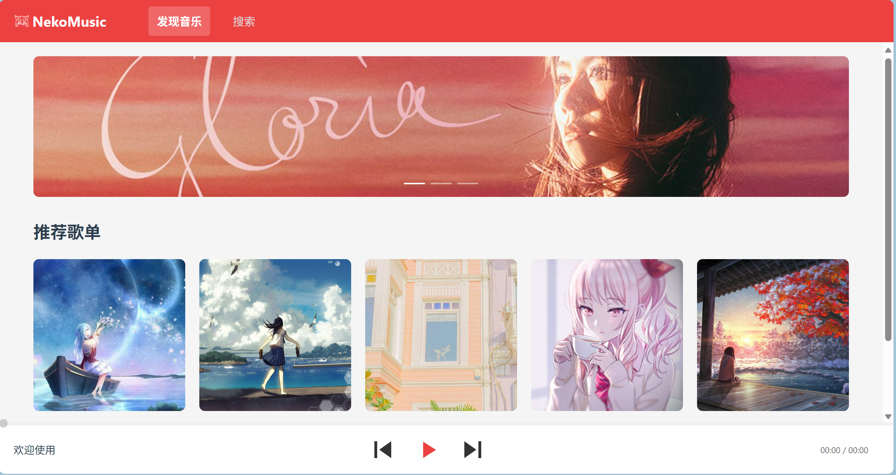
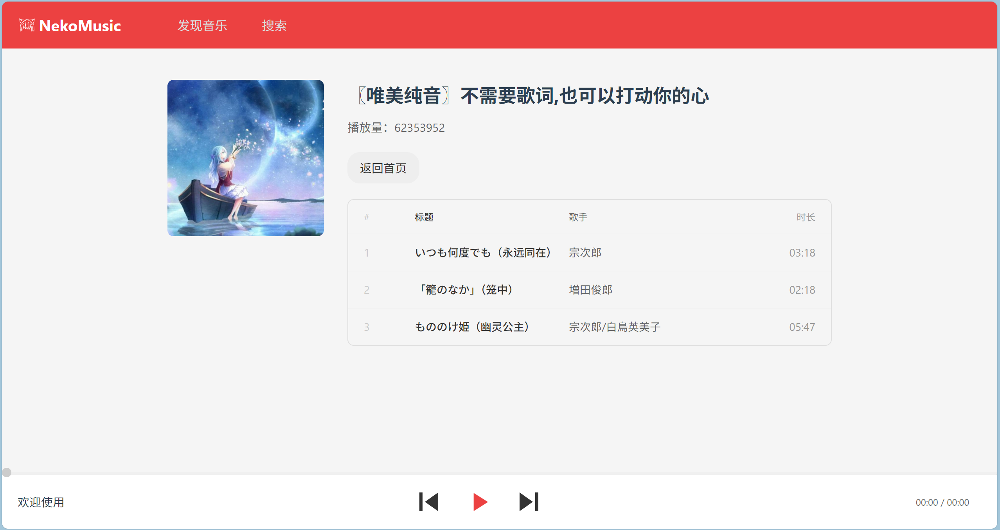
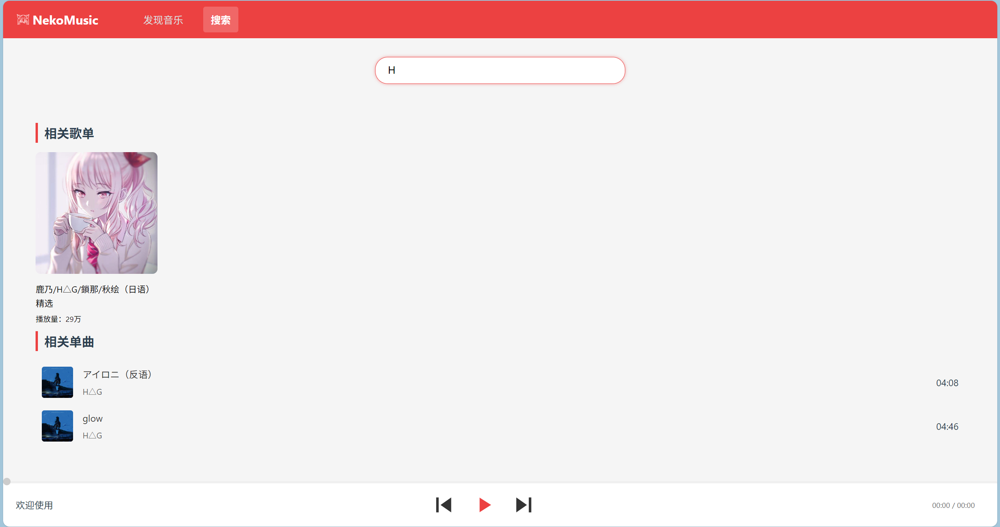
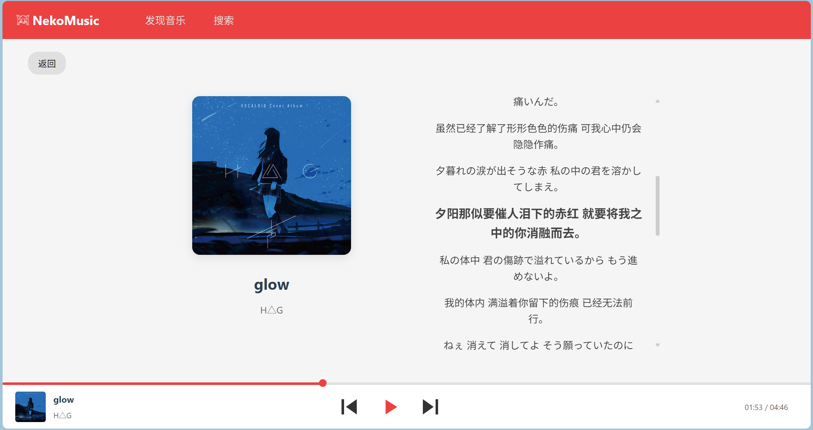

# 网易云音乐仿站项目

## 项目简介
本项目为个人学习与研究用途，低仿网易云音乐 Web 网页，实现了基础的音乐播放、歌单浏览、搜索等功能，前后端分离，适合前端和后端开发者参考和二次开发。

## 技术栈
- 前端：Vue 3、TypeScript、Vite、Pinia、Vue Router、CSS3
- 后端：Spring Boot、Java 17
- 其他：本地 Mock 数据、前后端分离架构

## 功能特性
- 本地音乐播放
- 歌曲进度调节
- 歌词滚动显示
- 歌单/歌曲搜索
- 响应式页面布局

## 项目结构
```
netease-music-clone/
├── public/                  # 公共资源
├── src/                     # 前端源码
│   ├── assets/              # 静态资源与样式
│   ├── components/          # 公共组件
│   ├── data/                # 本地数据
│   ├── router/              # 路由配置
│   ├── stores/              # 状态管理
│   ├── views/               # 页面视图
│   └── main.ts              # 入口文件
├── my-vue-backend/          # 后端 Spring Boot 项目
│   └── demo/
│       ├── src/main/java/   # 后端源码
│       ├── src/main/resources/ # 配置与 mock 数据
│       └── pom.xml          # Maven 配置
├── package.json             # 前端依赖配置
├── README.md                # 项目说明
└── ...
```

## 快速启动

### 前端
```bash
# 安装依赖
npm install
# 启动开发服务器
npm run dev
```
访问：http://localhost:5173

### 后端
```bash
# 进入后端目录
cd my-vue-backend/demo
# 使用 Maven 启动
./mvnw spring-boot:run
```
默认端口：8080

## 截图
- 主页界面  
  
- 歌单界面  
  
- 搜索界面  
  
- 歌曲界面  
  

## 贡献指南
欢迎提交 issue 或 PR 参与项目完善。建议遵循以下流程：
1. Fork 本仓库
2. 新建分支进行开发
3. 提交 PR 并描述修改内容

## 许可证
本项目仅供学习与交流，禁止用于商业用途。
